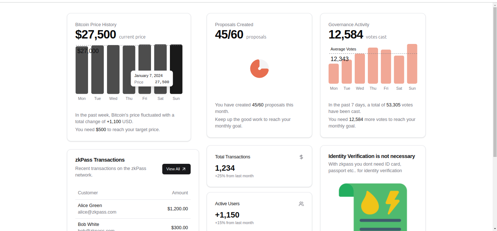

# zkPass Data Verification App

## Overview

This project is a **Next.js** application that directs users to verify their private data using **zkPass**. It leverages zkPass's zero-knowledge protocol, ensuring secure and private verification without exposing sensitive information.


## Objective

The app's primary goal is to direct users to an external verification website, **zkPass**, where private data can be securely verified.

## Features




- **User Redirection**: Guides users to the zkPass platform for private data verification.
- **Zero-Knowledge Security**: Data verification is done without revealing the actual data.
- **Responsive UI**: Built with Tailwind CSS to ensure mobile and desktop responsiveness.
- **Currency Convertor**: A tool to convert crypto currencies.
- **Details page**: An additional page that provides further information about zkPass.

## Technologies Used


- **Next.js**: A React framework for server-side rendering and static site generation.
- **Tailwind CSS**: For responsive and modern UI styling.
- **zkPass API**: Provides the privacy-preserving data verification protocol.

## Installation

To run this project locally, follow these steps:

1. **Clone the repository**:
    ```bash
    git clone https://github.com/Baah-Danso-Kenneth/zkPass-Verification-App/
    ```

2. **Navigate into the project directory**:
    ```bash
    cd zkpass-verification-app
    ```

3. **Install dependencies**:
    ```bash
    npm install
    ```

4. **Start the development server**:
    ```bash
    npm run dev
    ```

5. **Open the app in your browser**:
    ```
    http://localhost:3000
    ```

## Folder Structure

```bash
zkappverification/
├── app/
│   └── dashboard/          # Main dashboard page
│       └── page.tsx        # Dashboard page implementation
├── components/
│   ├── Custom/             # Custom reusable components
│   │   ├── proposals.tsx   # Proposal-related component
│   │   └── welcome_dashboard.tsx  # Welcome component for dashboard
│   ├── ui/                 # UI-related components
│   │   ├── cards.tsx       # Card component
│   │   ├── select.tsx      # Custom select component
│   │   └── tabs.tsx        # Tab navigation component
├── public/
│   └── assets/             # Static assets
│       ├── app_currency_convertor.png  # Screenshot of currency converter
│       ├── app-screen.png  # General screenshot of the app
│       └── app_details.png  # Additional details screenshot
├── package.json            # Dependencies and scripts
└── README.md               # Project documentation
